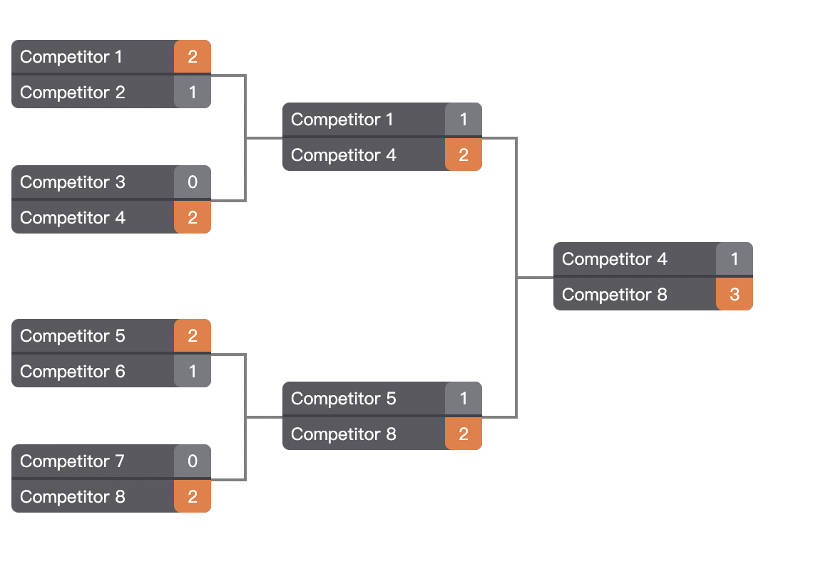
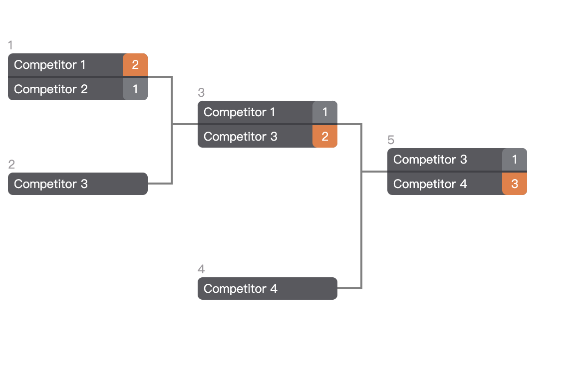

# Vue Tournament

Tournament brackets generator using Vue.

base on [vue-tournament-bracket](https://github.com/kamilwylegala/vue-tournament-bracket) and combine ui style of [react-tournament-bracket](https://github.com/moodysalem/react-tournament-bracket)



## Installation and component usage

Install component via:
```
npm install vue-tournament
```

Example:
```html
<template>
  <TournamentBracket :rounds="rounds" @onMatchClick="onMatchClick" />
</template>

<script lang="ts">
import IRound from "./interface/IRound";

import { Component, Vue } from "vue-property-decorator";
import TournamentBracket from "./TournamentBracket.vue";

@Component({
  components: {
    TournamentBracket,
  },
})
export default class App extends Vue {
  rounds: IRound[] = [
    //Quarter
    {
      matchs: [
        {
          id: "match1",
          winner: "1",
          team1: { id: "1", name: "Competitor 1", score: 2 },
          team2: { id: "2", name: "Competitor 2", score: 1 },
        },
        {
          id: "match2",
          winner: "4",
          team1: { id: "3", name: "Competitor 3", score: 0 },
          team2: { id: "4", name: "Competitor 4", score: 2 },
        },
        {
          id: "match3",
          winner: "5",
          team1: { id: "5", name: "Competitor 5", score: 2 },
          team2: { id: "6", name: "Competitor 6", score: 1 },
        },
        {
          id: "match4",
          winner: "8",
          team1: { id: "7", name: "Competitor 7", score: 0 },
          team2: { id: "8", name: "Competitor 8", score: 2 },
        },
      ],
    },
    //Semi
    {
      matchs: [
        {
          id: "match5",
          winner: "4",
          team1: { id: "1", name: "Competitor 1", score: 1 },
          team2: { id: "4", name: "Competitor 4", score: 2 },
        },
        {
          id: "match6",
          winner: "8",
          team1: { id: "5", name: "Competitor 5", score: 1 },
          team2: { id: "8", name: "Competitor 8", score: 2 },
        },
      ],
    },
    //Final
    {
      matchs: [
        {
          id: "any_match_id",
          winner: "8",
          team1: { id: "4", name: "Competitor 4", score: 1 },
          team2: { id: "8", name: "Competitor 8", score: 3 },
        },
      ],
    },
  ];

  private onMatchClick(matchId: string | number): void {
    alert(`click: ${matchId}`);
  }
}
</script>
```

### FeedIn

You can use feed-in to display seeded round



``` json
[
    {
        "matchs": [
            {
                "id": "match1",
                "winner": "1",
                "team1": {
                    "id": "1",
                    "name": "Competitor 1",
                    "score": 2
                },
                "team2": {
                    "id": "2",
                    "name": "Competitor 2",
                    "score": 1
                }
            },
            {
                "id": "match2",
                "feedIn": {
                    "id": "3",
                    "name": "Competitor 3"
                }
            }
        ]
    },
    {
        "matchs": [
            {
                "id": "match3",
                "winner": "3",
                "team1": {
                    "id": "1",
                    "name": "Competitor 1",
                    "score": 1
                },
                "team2": {
                    "id": "3",
                    "name": "Competitor 3",
                    "score": 2
                }
            },
            {
                "id": "match4",
                "feedIn": {
                    "id": "4",
                    "name": "Competitor 4"
                }
            }
        ]
    },
    {
        "matchs": [
            {
                "id": "any_match_id",
                "winner": "4",
                "team1": {
                    "id": "3",
                    "name": "Competitor 3",
                    "score": 1
                },
                "team2": {
                    "id": "4",
                    "name": "Competitor 4",
                    "score": 3
                }
            }
        ]
    }
]
```

## Development

Checkout repository and:
```
npm install
npm run serve
```

Then open browser and test your changes using `App.vue` main component for development purposes.

See `package.json` to discover available commands.

## Releasing

```
git commit
npm version <version>
git push
npm run deploy
```

## License

MIT